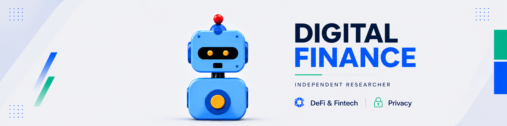

  

  <strong>EN:</strong> Independent researcher exploring digital finance, DeFi, blockchain privacy, and decentralized infrastructure.
   
  <strong>ES:</strong> Investigador independiente enfocado en finanzas digitales, DeFi, privacidad blockchain e infraestructura descentralizada.

### Writing & Guides | Escritura y guías

- **ES:** [Privacidad en transacciones con stablecoins y compliance](https://cyberprevention.academiadebatesociedad.com/privacidad-en-transacciones-con-stablecoins-y-compliance/) · **EN:** Privacy in Stablecoin Transactions and Compliance — September / septiembre 2026
- **ES:** [Hermes Agent: de la IA conversacional a la automatización inteligente para empresas críticas](https://hackmd.io/@Y_gnYtUbTKifBLLd9FCZWQ/SJYh1OLxGe) · **EN:** Hermes Agent: From Conversational AI to Intelligent Automation for Critical Enterprises — May / mayo 2026
- **EN:** [Complete Guide: NEAR Protocol Validator Node on Testnet](https://hackmd.io/@Y_gnYtUbTKifBLLd9FCZWQ/S1rSG0dMZe) · **ES:** Guía completa: nodo validador de NEAR Protocol en Testnet — December / diciembre 2025
- **ES:** [Aplicaciones prácticas de las pruebas de conocimiento-cero en el mundo real](https://hackmd.io/@Y_gnYtUbTKifBLLd9FCZWQ/H1XUS6Ulxl) · **EN:** Practical Applications of Zero-Knowledge Proofs in the Real World — August / agosto 2025
- **ES:** Traducción al español de «Programando ZKPs: De cero a héroe» · **EN:** Spanish translation of “Programming ZKPs: From Zero to Hero” — July / julio 2025
- **ES:** [Intro y comparación: ZK vs FHE vs MPC](https://seedlatam.gitbook.io/seedlatam/avanzado-topicos/privacidad/intro-y-comparacion-zk-vs-fhe-vs-mpc) · **EN:** Introduction and Comparison: ZK vs FHE vs MPC — June / junio 2025
- **EN:** [Fully Homomorphic Encryption](https://hackmd.io/@Y_gnYtUbTKifBLLd9FCZWQ/SJu4JxMpR) · **ES:** Cifrado totalmente homomórfico — April / abril 2025
- **ES:** [Actualización del Nodo Nym](https://medium.com/@bwnym/actualizaci%C3%B3n-del-nodo-nym-1d6561b2ae71) · **EN:** Nym Node Update — May / mayo 2024
- **ES:** [Guía para montar un nodo Gateway de NYM](https://medium.com/@bwnym/gu%C3%ADa-para-montar-un-nodo-gateway-de-nym-3893bf07dfe1) · **EN:** Guide to Setting Up a NYM Gateway Node — April / abril 2024
- **ES:** [Mover un Gateway a una nueva VPS](https://medium.com/@bwnym/migraci%C3%B3n-gateway-a-una-nueva-vps-4b9e828759ae) · **EN:** Moving a Gateway to a New VPS — April / abril 2024
- **ES:** [Mover la Mixnode a una nueva VPS](https://medium.com/@bwnym/migraci%C3%B3n-mixnode-a-una-nueva-vps-990abe1e15d9) · **EN:** Moving a Mixnode to a New VPS — April / abril 2024

### Talks & Events | Charlas y eventos

- **ES:** [Ethereum en tu bolsillo: la guía práctica de wallets](https://www.instagram.com/ethecuador/p/DN6HiZuEfiy/?img_index=4) · **EN:** Ethereum in Your Pocket: A Practical Guide to Wallets — August / agosto 2025
- **ES/EN:** [Privacy Pools. Privacidad con transparencia selectiva](https://www.instagram.com/ethecuador/p/DMtRIKtMQJT/?img_index=3) · **EN:** Privacy Pools: Privacy with Selective Transparency — July / julio 2025
- **ES:** [Bitcoin y las tecnologías que lo hacen posible: un viaje por el futuro del dinero](https://www.instagram.com/flisolguayaquil/p/DKSxi5Su3G0/?img_index=3) · **EN:** Bitcoin and the Technologies That Make It Possible: A Journey into the Future of Money — May / mayo 2025
- **ES:** [Bitcoin, desafío a la censura como sistema de pagos](https://www.instagram.com/pythonecuador/p/CzlyVqJr7iV/) · **EN:** Bitcoin: Challenging Censorship as a Payment System — November / noviembre 2023
- **ES:** [Privacidad vs. transparencia en Blockchain: Tecnologías ZK](https://www.instagram.com/p/DKKXdFARk4y/) · **EN:** Privacy vs. Transparency on Blockchain: ZK Technologies
- **ES:** [DAppNode: Corre tu propio nodo con software libre](https://www.instagram.com/p/DX7-Y4mMKcc/) · **EN:** DAppNode: Run Your Own Node with Open-Source Software
